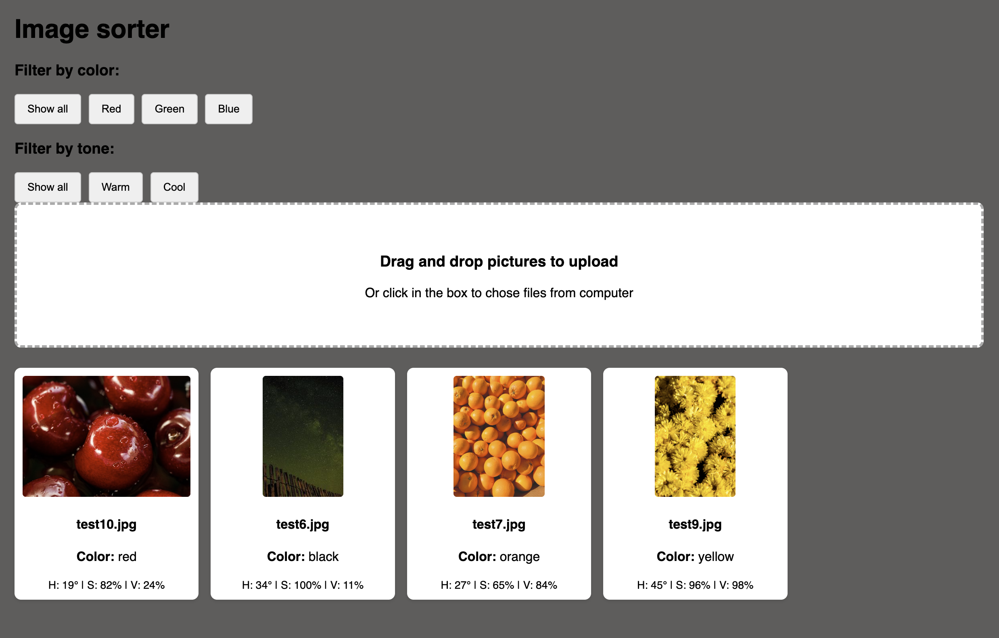
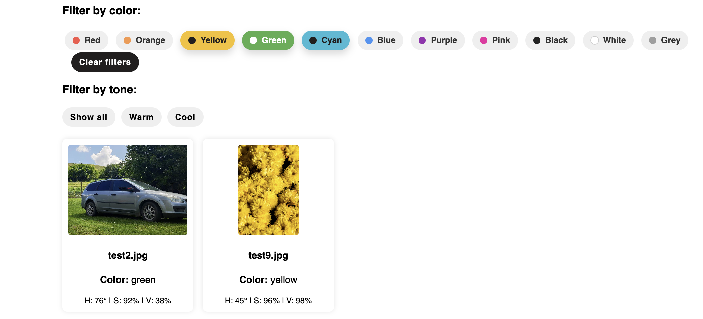

# Image Analyzer

Image Analyzer is a Go-based image analysis tool that classifies and filters images based on dominant colors and overall color tone.

The application reads images from a local image folder, analyzes the pixels of each image, converts RGB values to HSV values, and classifies pixels into different color categories such as Red, Blue, Green, Yellow, Purple, etc.

The dominant color of an image is determined by counting how many pixels belong to each color category and selecting the category with the highest occurrence.

The project also includes a local HTTP server and a simple API system that allows images to be filtered through URL query parameters.

## AI usage

To help complete the project we used AI tools such as ChatGPT and Gemini, as well as the Q&A website Stack Overflow.

## Demo

## Features

- Analyze JPG, JPEG and PNG images
- Read and process all images in an image folder
- Ignore unsupported file types automatically
- Convert RGB color values to HSV
- Classify pixels into color categories
- Determine dominant image color
- Filter images by dominant color
- Filter images by warm/cool tone
- Return results as JSON through API

## How it works

- The application reads all files from the img folder
- Unsupported file types and directories are skipped
- Each image is decoded and processed pixel by pixel
- Every pixel is converted from RGB to HSV
- HSV values are used to classify each pixel into a color category
- The application counts how many pixels belong to each category
- The dominant category is selected and returned as the image result
- Filtering can be applied through the API

## API

Get all analyzed images:
/api/images

Filter by color:
/api/images?color=Red

Filter by tone:
/api/images?tone=warm

Combine filters:
/api/images?color=Red&tone=warm

## How to run

Run in terminal:
go run .

The server starts locally at:
http://localhost:8080

Open in browser:
http://localhost:8080

API examples:
http://localhost:8080/api/images
http://localhost:8080/api/images?color=Red
http://localhost:8080/api/images?tone=warm
http://localhost:8080/api/images?color=Red&tone=warm